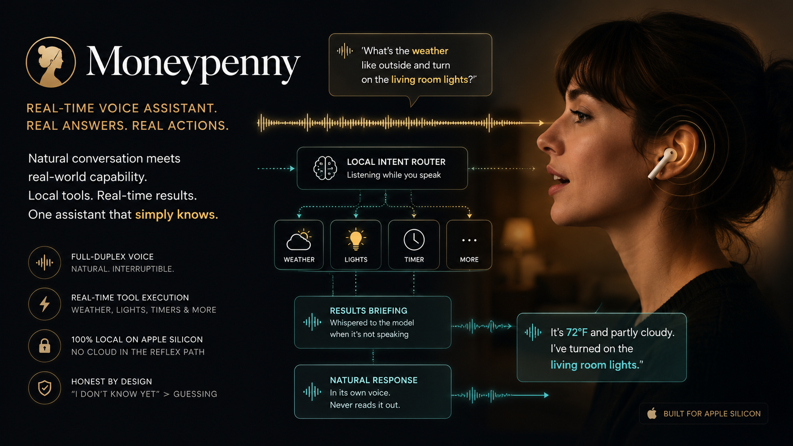

# Moneypenny



A voice assistant that runs on your Mac. A full-duplex speech model carries the conversation, and a toolchain feeds it facts through a synthetic earpiece.

Full-duplex speech models hold a conversation well and invent facts badly. Moneypenny splits the job. PersonaPlex talks to you. A router (Qwen3, local) reads the live transcript from streaming ASR and fires tools for weather, Homey devices, and timers while you finish your sentence. Each tool result comes back as a terse spoken briefing, synthesized in a second voice and played into the model's audio input once the model stops speaking. The model works the facts into its reply in its own words. You hear one assistant. The briefing channel stays inaudible.

Every model runs on Apple Silicon: PersonaPlex for speech, parakeet for ASR, Qwen3 for routing, Kokoro for briefing TTS. The reflex path makes no cloud calls.

The spec lives in `docs/moneypenny-spec.md`. Architecture decisions, with the spike evidence behind them, live in `docs/decisions/`.

## Requirements

- Apple Silicon Mac (MLX). Measured real time on an M3 Ultra: 12.5 fps, 64 ms per engine step.
- Python 3.12
- A local checkout of `personaplex-mlx`; weights for `nvidia/personaplex-7b-v1` download to your Hugging Face cache on first run
- For open speakers: `brew install speexdsp`. Built-in echo cancellation cancels the model's voice out of the mic (measured 20-30 dB on this hardware, residual below room ambient once converged). Headphones still give the cleanest capture and need none of this; without the dylib the app starts normally and just runs without AEC.

## Setup

```bash
brew install speexdsp  # echo cancellation for open-speaker setups (optional)

python3.12 -m venv .venv
source .venv/bin/activate

# personaplex-mlx installs from a local checkout, not PyPI:
pip install -e ~/orca/personaplex-mlx
# If its pinned deps conflict with yours, use --no-deps; this repo's
# pyproject declares everything the engine imports:
#   pip install -e ~/orca/personaplex-mlx --no-deps

pip install -e ".[dev]"
```

Generate the test fixtures once before running the slow suite:

```bash
python spikes/make_fixtures.py
```

## Tests

```bash
pytest          # fast suite: pure logic, no model loads
pytest -m slow  # loads real models, hits live services
pytest -m ""    # everything
```

The slow tests run real inference. There are no mocked models anywhere in the suite.

## Run

Copy `.env.example` to `.env`. `HOMEY_BASE_URL` and `HOMEY_API_KEY` are optional; without them the app starts with home control disabled and says so when asked to touch the lights. Set `VAD_RMS_THRESHOLD` above your room's noise floor (the status log prints `micRMS` so you can read it off).

Speakers work: every frame the app plays is also the far-end reference for a speex echo canceller on the mic path, so the model stops hearing its own voice. Measured on this hardware: 20-30 dB of echo suppression, residual below room ambient within 2-3 seconds of the model speaking; in the live A/B the greeting produced phantom self-routes with the canceller off and zero VAD events with it on. The pairing is anchored by hardware timestamps, so if a stream loses samples under load the canceller re-converges in a couple of seconds instead of dying silently (the `aecslips` status counter ticks when that happens). The first second of the very first utterance can still blip the VAD before the filter converges; the classification gate absorbs that. Loud rooms with hot mics may still leak fragments during long model turns, so headphones remain the gold standard. `ECHO_CANCEL=0` turns the canceller off.

```bash
.venv/bin/moneypenny
```

The log prints a status line every two seconds:

```
status: micq=0 spkq=13 underruns=154 aecslips=0 micRMS=0.015 vad=False asr_on=False fps=12.5 asr_ms=0 step_ms=63
```

Healthy idle: `fps=12.5`, `asr_on=False`, `micq=0`, `underruns` flat after warm-up. ASR runs on its own worker while you speak, briefing TTS runs on another, and the engine never waits for either.

## Web UI

`moneypenny-web` serves a dashboard at http://127.0.0.1:8765 (localhost only, no auth). Models load at startup, same as the CLI. Start/End in the browser controls the conversation; the wave shows the mic (gold) and model (teal) channels, and the activity feed shows live transcripts, route tiers, tool runs, and briefings. Set `MONEYPENNY_WEB_PORT` to change the port. The headless `moneypenny` CLI still works as before.

```bash
.venv/bin/moneypenny-web
```

## Voices

Two voices, two audiences, set by environment variable:

- `MONEYPENNY_VOICE` (default `NATF2`): the PersonaPlex voice you hear. Shipped prompts: `NATF0`-`NATF3`, `NATM0`-`NATM3`, `VARF0`-`VARF4`, `VARM0`-`VARM4`.
- `BRIEFING_VOICE` (default `am_michael`): the Kokoro voice that reads tool briefings to the model. Only the model hears it. Keep it distinct from your own voice; the model treats a briefing in a user-like voice as user speech and answers it instead of absorbing it (`docs/decisions/0001-injection-mechanism.md`). A typo'd voice name aborts at startup with a probe error instead of failing at the first briefing.

## Status and known limits

Phase 1. Acceptance results, fact-bait scores, and the pending live checklist sit in `docs/decisions/0002-phase1-acceptance.md`. The conversation-quality fixes for open speakers (engine warm-up, classification gate, clarification restraint, echo cancellation) and their live verification are recorded in `docs/decisions/0003-conversation-quality.md`. Two limits worth knowing before you file a bug:

- A continuous session crashes after about 5.5 minutes: rustymimi's streaming encoder has a fixed 8192-position cache (limitation 8 in the acceptance doc).
- Briefing uptake is probabilistic. The injection mechanism works, and the model still hedges or rephrases on some trajectories (open risks in decision 0001).
